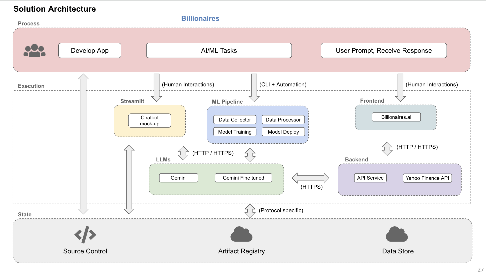
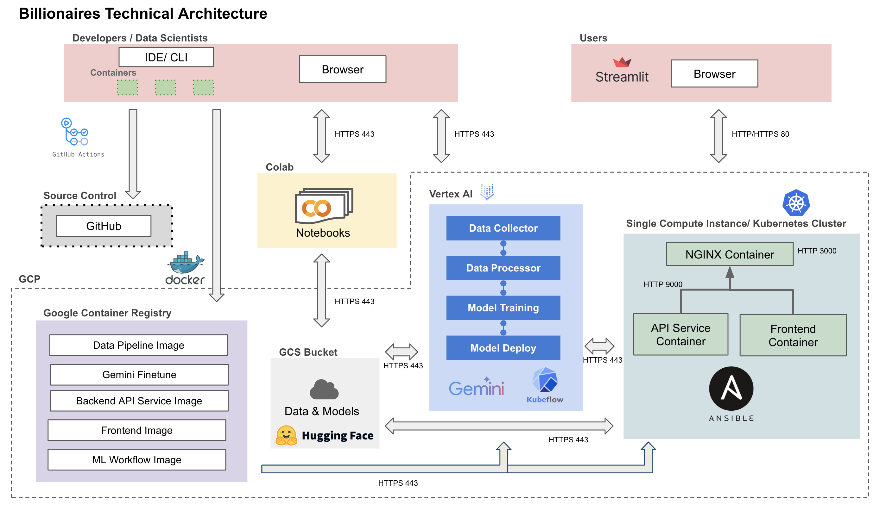
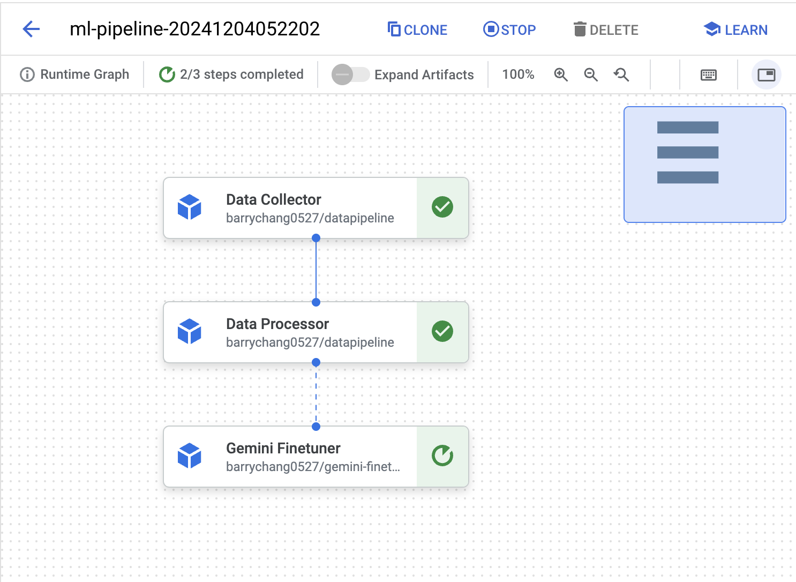
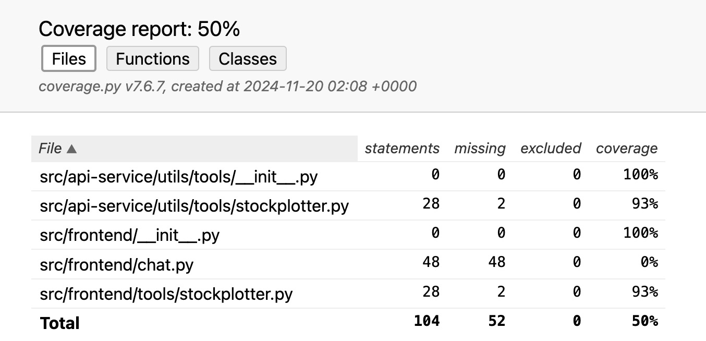

# AC215 - Billionaires AI 

**Team Members:** Huandong Chang, Mingyuan Ma, Lance Lu, April Zhang

**Group Name:** Billionaires

**Project:** In this project, we aim to develop a platform that automatically connects to a financial database, scrapes data from various online sources, provides analytical and visualization tools, and allows for natural language querying through a chatbot interface. This project aims to reduce the rigidity and repetition in traditional data analysis workflows by providing a more dynamic and automated approach to financial data processing and visualization.

## Application Design Document



## Frontend
Inside `\src\api-service`, run `sh docker-shell.sh` to launch the backend API host. Then, inside `src\frontend`, run `sh docker-shell.sh` to launch the frontend host. The frontend will be running at [http://localhost:8501](http://localhost:8501).

## Continuous Integration Setup
CI is triggered on every push or pull request to the milestone4_CI_test branch.
Steps:
* Check out the code.
* Set up Docker Buildx and cache layers for efficiency.
* Install Docker Compose and build images.
* Start Docker containers using docker-compose.
* Wait for services to initialize.
* Set up Python and install dependencies using Pipenv.
* Run flake8 for linting (optional, can be enabled).
* Execute integration tests using pytest with coverage reporting.
* Upload the test coverage report.
* Tear down Docker containers after tests.

Secrets Management
The `API_KEY` is securely managed through GitHub Secrets. It is automatically injected into the environment during CI.

## ML Workflow
ML Workflow allows users to to conduct data collection, data processing, and model finetuning with a single click. Under src/workflow, run `bash docker-shell.sh` and then run `python cli.py` to start the ml workflow.


## Setup Instructions
### Prerequisites
Before you begin, ensure you have the following installed on your machine:
* **Docker:** To build and run containers locally.
* **Kubernetes:** To deploy containers in a cluster environment.
* **kubectl:** Command-line tool for controlling Kubernetes clusters.
* **Google Cloud SDK:** If deploying to Google Kubernetes Engine (GKE).
* **Pipenv:** For managing Python dependencies.

### Environment Variables
Ensure the following environment variables are set:
* `OPENAI_API_KEY`: Your OpenAI API key, stored in a file at `../../../secrets/openai_key.txt`.

### Docker Setup
1. **Build Docker Images**

   Navigate to the respective directories and build the Docker images:

   ```bash
   # For API Service
   cd src/api-service
   docker build -t api-service -f Dockerfile .

   # For Frontend
   cd src/frontend
   docker build -t frontend -f Dockerfile .
   ```

2. **Run Docker Containers**

   Ensure the Docker network is created:

   ```bash
   docker network create my-network
   ```

   Run the containers:

   ```bash
   # For API Service
   docker run --rm --network my-network --name api-service -p 8001:8001 \
     -v "$(pwd)/../../../secrets":/run/secrets/openai_key:ro \
     -e OPENAI_API_KEY=$(cat ../../../secrets/openai_key.txt) \
     api-service

   # For Frontend
   docker run --rm --network my-network --name frontend -it -p 8501:8501 frontend
   ```

### Kubernetes Setup
1. **Deploy API Service**

   Apply the Kubernetes deployment and service configuration:

   ```bash
   kubectl apply -f src/deployment/api-deployment.yaml
   ```

2. **Deploy Frontend**

   Apply the Kubernetes deployment and service configuration:

   ```bash
   kubectl apply -f src/deployment/frontend-deployment.yaml
   ```

3. **Verify Deployments**

   Check the status of your deployments:

   ```bash
   kubectl get deployments
   kubectl get services
   ```

## Deployment Instructions
### Docker Deployment
1. Ensure Docker is running.
2. Follow the Docker setup instructions above to build and run the containers.

### Kubernetes Deployment
1. Ensure your Kubernetes cluster is running and `kubectl` is configured to interact with it.
2. Follow the Kubernetes setup instructions  above to deploy the services.

### Notes
* Ensure that your `secrets` directory is correctly set up and accessible.
* Modify the `GCP_PROJECT` and `GCP_ZONE` variables in your scripts if deploying to GKE.
* The `docker-entrypoint.sh` script in the API service ensures the application runs on the specified port.

## Usage Details and Examples
Our project leverages the phidata framework to create agents equipped with memory, knowledge, tools, and reasoning. By connecting with reliable real-time data sources like Yahoo Finance, the chatbot offers robust capabilities to address diverse user needs.

Here are some examples of what our chatbot can do:
1. **Get Real-Time News**
   
   Users can request the latest news on a specific company or field. The chatbot provides:
   * Summaries of key developments
   * Direct links to full articles
   * Relevant images for visual context
2. **Analyze Stock Prices**

   Users can query real-time or historical stock data. Key features include:
   * Trajectories of historical stock prices for multiple companies
   * Interactive plots, allowing users to zoom and hover for precise data points
3. **Receive Portfolio Advice**

   Personalized financial advice tailored to user preferences and budget:
   * Suggested portfolio allocations
   * Clear, concise explanations of investment recommendations
4. **Email Reports**

   Registered users can request a curated report summarizing all or part of their chatbot conversation, conveniently delivered to their email.

By combining intelligent automation with real-time data and personalization, our tool bridges the gap between technical insights and user-friendly interactions.

## Known Issues and Limitations
### User Interface (UI)
* The current UI lacks certain user-friendly features such as:
  * A detailed user manual
  * Chat history functionality
* Improvements in these areas are needed to enhance user experience.

### External API Integration
* Institutions are hesitant to share their APIs and data directly with OpenAI.
* A secure and reliable mechanism for integrating external APIs is required to build trust and ensure seamless interoperability.

### Limited Functionalities
* The tool currently does not include:
  * A dashboard for data visualization
  * Tools for portfolio return tracking
* Expanding these features will improve the tool's versatility and usability.

## Data
Our data is [reddit_finance_43_250k](https://huggingface.co/datasets/winddude/reddit_finance_43_250k), a collection of 250k post/comment pairs from 43 financial, investing and crypto subreddits. Post must have all been text, with a length of 250 chars, and a positive score. Each subreddit is narrowed down to the 70th qunatile before being mergered with their top 3 comments and than the other subs. Further score-based methods are used to select the top 250k post/comment pairs. We stored this 680MB dataset in a private Google Cloud Bucket under the `raw/` folder as `top.jsonl`.

## Containers
Our Dockerfiles all follow the standard convention. Run the containers for each component with `sh docker-shell.sh`. For the gemini-finertuner container, Windows users may need to run `bash docker-shell.sh` instead.

## Data Pipeline
Under the folder `src/datapipeline`, the following files construct our data pipeline:
1. **`dataloader.py`:** downloads raw/processed data from the Google Cloud Bucket. Use a command line argument to specify the folder to download from. For example, running `python dataloader.py raw` will download the raw `raw/top.jsonl` file, and running `python dataloader.py reddit_500` will download the processed train and test sets `reddit_500/train.jsonl` and `reddit_500/test.jsonl` totaling 500 rows if they already exist in the bucket.
2. **`preprocess.py`:** process the raw `top.jsonl` file to produce new train and test sets locally. Use a command line argument to specify the sample size. For example, running `python preprocess.py 500` will locally generate new train and test sets `train.jsonl` and `test.jsonl` totaling 500 rows.
3. **`upload.py`:** uploads the local train and test sets into the Google Cloud Bucket. For example, running `python upload.py reddit_500` will upload the local `train.jsonl` and `test.jsonl` files into the `reddit_500` folder in the bucket.

## Testing
The tests are written using `PyTest`. For developers to replicate test results locally, run `sh docker-shell.sh` in the root directory and find the coverage report in `htmlcov/index.html`.

